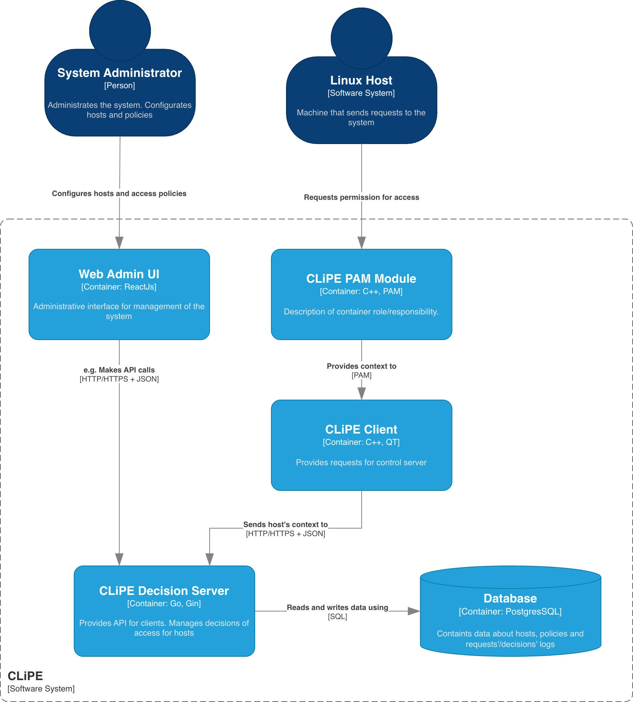
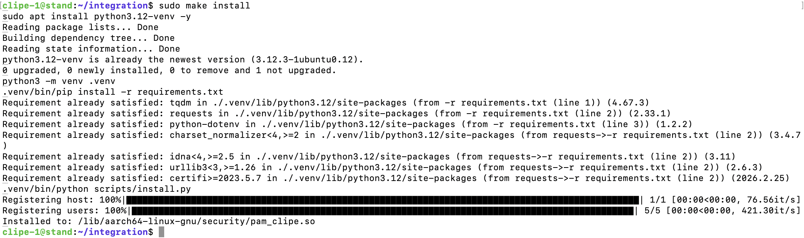
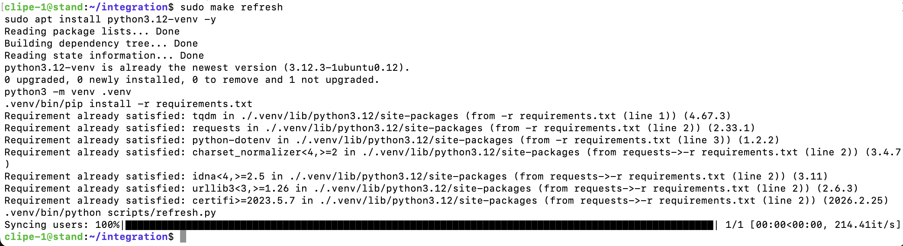
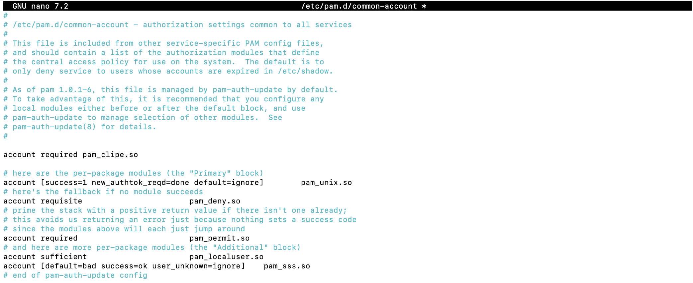
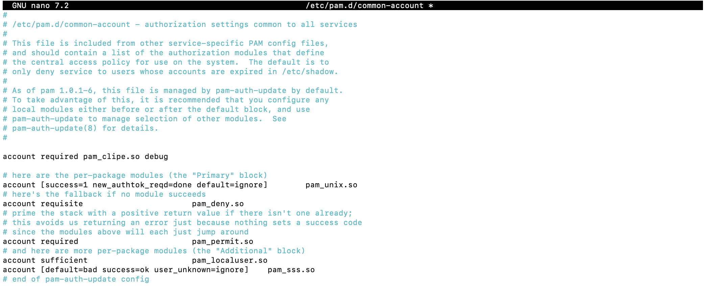
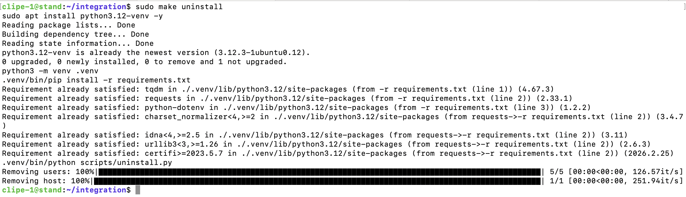
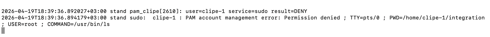
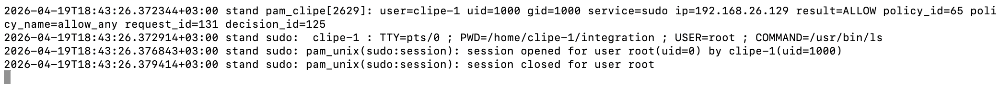

# Руководство пользователя CLiPE (Centralized Linux Policy Engine)

---

## Аннотация

Настоящий документ является руководством пользователя системы **CLiPE** (Centralized Linux Policy Engine) — централизованной системы контроля доступа на основе политик и правил для Linux-хостов.

Документ предназначен для администраторов и инженеров по безопасности, осуществляющих развёртывание, настройку и эксплуатацию системы CLiPE.

---

## Содержание

1. [Введение](#1-введение)
   - 1.1. [Область применения](#11-область-применения)
   - 1.2. [Краткое описание возможностей](#12-краткое-описание-возможностей)
   - 1.3. [Уровень подготовки пользователя](#13-уровень-подготовки-пользователя)
   - 1.4. [Перечень эксплуатационной документации](#14-перечень-эксплуатационной-документации)
   - 1.5. [Используемые технологии](#15-используемые-технологии)
   - 1.6. [Архитектура](#16-архитектура)
2. [Назначение и условия применения](#2-назначение-и-условия-применения)
3. [Подготовка к работе](#3-подготовка-к-работе)
   - 3.1. [Состав и содержание дистрибутивного носителя данных](#31-состав-и-содержание-дистрибутивного-носителя-данных)
   - 3.2. [Порядок загрузки данных и программ](#32-порядок-загрузки-данных-и-программ)
   - 3.3. [Порядок проверки работоспособности](#33-порядок-проверки-работоспособности)
4. [Описание операций](#4-описание-операций)
5. [Аварийные ситуации](#5-аварийные-ситуации)
6. [Рекомендации по освоению](#6-рекомендации-по-освоению)
7. [Термины и сокращения](#7-термины-и-сокращения)
8. [Лист регистрации изменений](#лист-регистрации-изменений)

---

## 1. Введение

### 1.1. Область применения

CLiPE применяется в инфраструктурах на базе Linux для централизованного управления доступом к сервисам и ресурсам хостов. Система обеспечивает принятие решений об аутентификации и авторизации на основе политик и правил, определённых администратором.

Типичные сценарии применения:
- Контроль доступа пользователей к Linux-хостам через SSH и другие PAM-совместимые сервисы.
- Централизованное управление политиками доступа в распределённой инфраструктуре.
- Аудит и логирование попыток доступа.

### 1.2. Краткое описание возможностей

CLiPE предоставляет следующие возможности:

- **Сервер принятия решений** — REST API сервер (Go + Gin), обрабатывающий запросы на доступ от PAM-модулей с хостов.
- **Панель администратора** — веб-интерфейс (JavaScript) для управления хостами, пользователями, политиками и правилами.
- **PAM-модуль интеграции** — динамическая библиотека `pam_clipe.so` (C++), встраиваемая в PAM-таблицы Linux-хостов.
- **Гибкая политика по умолчанию** — настраиваемое решение (`ALLOW` / `DENY`) при отсутствии явной политики.
- **HTTPS** — защищённое соединение между PAM-модулем и сервером.
- **Логирование** — запись событий доступа в `syslog` (`/var/log/auth.log`).
- **Скрипты автоматизации** — Python-скрипты и Makefile-цели для установки, обновления и удаления модуля.

### 1.3. Уровень подготовки пользователя

Пользователь (администратор) должен обладать следующими знаниями и навыками:

- Администрирование Linux-систем (Ubuntu 22.04 / 24.04 и совместимые).
- Базовое понимание механизма PAM (Pluggable Authentication Modules).
- Навыки работы с командной строкой: `bash`, `ssh`, `scp`, `openssl`.
- Базовое понимание Docker и принципов контейнеризации.
- Понимание принципов работы REST API (опционально, для расширенной настройки).

### 1.4. Перечень эксплуатационной документации

При эксплуатации системы CLiPE следует руководствоваться:

- Настоящим руководством пользователя.
- Документацией по PAM: https://man7.org/linux/man-pages/man5/pam.d.5.html
- Документацией Docker: https://docs.docker.com

### 1.5 Используемые технологии

| Зона ответственности            | Технологии |
|--------------------------------|-----------|
| REST API сервер                       | Go + Gin |
| Модуль интеграции               | C++ (PAM)|
| Панель администратора                    | JavaScript |
| База данных                   | PostgreSQL|
| Инфраструктура и деплой       | Docker|
| Сборка и установка            | CMake + Make |
| Автоматизация                 | Python |
| Тестирование API                  | Hoppscotch|
| Среда разработки / тестирования | Ubuntu 24.04 (ARM64), VMware Fusion|

### 1.6 Архитектура




---

## 2. Назначение и условия применения

**CLiPE** (Centralized Linux Policy Engine) — система централизованного контроля доступа для Linux-хостов. Предназначена для организаций, которым требуется единая точка управления политиками доступа к Linux-инфраструктуре.

**Архитектура системы** состоит из трёх компонентов:

1. **CLiPE Server** — центральный сервер с двумя независимыми HTTP-серверами:
   - *Decision Server* — принимает запросы на доступ и возвращает решение `ALLOW` / `DENY`.
   - *CRUD Server* — предоставляет API для управления объектами системы (хосты, пользователи, политики, правила).
2. **Admin Panel** — веб-панель администратора, взаимодействующая с CRUD Server.
3. **PAM Module (`pam_clipe.so`)** — библиотека, устанавливаемая на целевые Linux-хосты и обращающаяся к Decision Server при каждой попытке доступа.

**Минимальные требования к среде:**

| Компонент | Требования |
|---|---|
| ОС сервера | Ubuntu 24.04 (AMD64 / ARM64) или совместимая |
| ОС хоста интеграции | Ubuntu 24.04 или совместимая Linux-система с PAM |
| Docker | Установлен на сервере |
| Сеть | TCP-доступ от хостов интеграции до сервера CLiPE |
| SSL | Сертификат сервера, подписанный центром сертификации |

---

## 3. Подготовка к работе

### 3.1. Состав и содержание дистрибутивного носителя данных

Исходный код и дистрибутив системы размещены в репозитории: https://github.com/ccrayp/CLiPE

Структура репозитория:

```
CLiPE/
├── server/           # Исходный код сервера (Go + Gin) и Makefile для запуска
├── pam_module/       # Исходный код PAM-модуля (C++)
├── integration/      # Готовая библиотека pam_clipe.so и скрипты установки
├── ssl/              # Директория для хранения SSL-сертификатов
├── documentation/    # Дополнительная документация
├── images/           # Изображения для документации
└── README.md         # Основная документация проекта
```

Директория `integration/` содержит:
- Скомпилированную библиотеку `pam_clipe.so` (для Ubuntu 24.04 ARM64).
- Python-скрипты управления (`install`, `refresh`, `uninstall`).
- `Makefile` с целями для вызова скриптов.
- Файл конфигурации URL сервера CLiPE.

# 3.2. Порядок загрузки данных и программ

- [ ] **3.2.1. Получение исходного кода**

```bash
git clone https://github.com/ccrayp/CLiPE.git
cd CLiPE
```

- [ ] **3.2.2. Настройка SSL-сертификатов**

Если у вас нет готового сертификата, выполните следующие шаги.

**Шаг 1.** Создание локального центра сертификации (CA):

```bash
openssl genrsa -out ca.key 4096
openssl req -x509 -new -nodes \
  -key ca.key \
  -sha256 \
  -days 3650 \
  -out ca.crt
```

**Шаг 2.** Создание серверного приватного ключа:

```bash
openssl genrsa -out server.key 2048
```

**Шаг 3.** Создание запроса на выпуск сертификата (CSR):

```bash
openssl req -new -key server.key -out server.csr
```

**Шаг 4.** Подписание серверного сертификата:

```bash
openssl x509 -req \
  -in server.csr \
  -CA ca.crt \
  -CAkey ca.key \
  -CAcreateserial \
  -out server.crt \
  -days 365 \
  -sha256 \
  -extfile server.ext
```

Полученные файлы `ca.crt`, `server.crt`, `server.key` разместите в директории `ssl/`.

- [ ] **3.2.3. Настройка конфигурации сервера**

Создайте файл `.env` в директории `server/` на основе примера.

> **Важно:** Замените значение `JWT_SECRET_KEY`, `INSTALLER_TOKEN`, `DECISION_TOKEN` на уникальные секретные ключи перед развёртыванием.

- [ ] **3.2.4. Развёртывание сервера CLiPE**

Убедитесь, что Docker установлен:

```bash
sudo apt install docker -y
```

Перейдите в папку `server/` и выполните сборку и запуск:

```bash
cd server/
make build
```

- [ ] **3.2.5. Подготовка хоста для интеграции**

**Шаг 1.** Скопируйте сертификат CA в папку `integration/`:

```bash
cp ssl/ca.crt ./integration/
```

**Шаг 2.** Укажите адрес сервера CLiPE в конфигурационном файле модуля (параметр `URL`), например:

```text
http://access.manager
```

**Шаг 3.** Скопируйте папку `integration/` на целевой Linux-хост:

```bash
scp -r ./integration user_name@host_name:~/path/to/directory
```

- [ ] **3.2.6. Сборка PAM-модуля (при необходимости)**

> Готовая библиотека `pam_clipe.so` для Ubuntu 24.04 ARM64 уже находится в папке `/integration`. Сборка требуется только при использовании другой архитектуры или ОС.

Установите зависимости на целевом хосте:

```bash
sudo apt install -y \
    cmake \
    g++ \
    libpam0g-dev \
    nlohmann-json3-dev \
    libcurl4-openssl-dev
```

Выполните сборку из директории `pam_module/`:

```bash
cmake -S . -B build
cmake --build build
cp build/lib/pam_clipe.so ../integration
```

- [ ] **3.2.7. Установка модуля на хост**

На целевом хосте перейдите в скопированную папку `integration/` и выполните:

```bash
sudo make install
```

Команда `install` выполняет:
- Установку необходимых библиотек.
- Регистрацию хоста и его пользователей в системе CLiPE.
- Автоматическое копирование `pam_clipe.so` в системную директорию PAM.



### 3.3. Порядок проверки работоспособности

**1. Проверка работы сервера CLiPE:**

Убедитесь, что контейнеры запущены:

```bash
docker ps
```

Проверьте доступность Decision Server:

```bash
curl http://<адрес_сервера>/api/v1/decide/health
```

Проверьте доступность CRUD Server:

```bash
curl http://<адрес_сервера>/api/v1/decide/health
```

**2. Проверка работы PAM-модуля:**

Добавьте `pam_clipe.so` в PAM-таблицу `common-account` (или таблицу конкретного сервиса):

```
account required pam_clipe.so
```

Попробуйте выполнить вход через SSH или другой PAM-совместимый сервис. Проверьте логи:

```bash
sudo tail -f /var/log/auth.log
```

При успешной работе в логах должны появляться записи с решением `ALLOW` или `DENY`.

---

## 4. Описание операций

### 4.1. Управление хостами и пользователями

Управление осуществляется через веб-панель администратора (CRUD Server) или напрямую через скрипты Makefile на хостах интеграции.

**Синхронизация пользователей хоста:**

```bash
sudo make refresh
```



Команда `refresh` синхронизирует пользователей: удаляет из системы несуществующих и регистрирует новых.

### 4.2. Управление политиками и правилами

Политики и правила доступа создаются и редактируются через панель администратора CLiPE.

Логика принятия решений:
- Если для сервиса существует **политика** с **правилами** — применяется правило.
- Если нет ни правила, ни политики — применяется `DEFAULT_DECISION` из конфигурации сервера.

### 4.3. Добавление модуля в PAM-таблицу

Для активации контроля доступа через CLiPE укажите библиотеку в PAM-таблице нужного сервиса или в общей таблице (`common-account`):

```
account required pam_clipe.so
```



Для включения отладочного режима добавьте аргумент `debug`:

```
account required pam_clipe.so debug
```


### 4.4. Удаление модуля с хоста

Для удаления модуля выполните:

```bash
sudo make uninstall
```



> **Важно:** Если `pam_clipe.so` ещё используется в PAM-таблицах, удаление будет прервано с соответствующей ошибкой. Сначала удалите запись из всех PAM-таблиц.

### 4.5. Просмотр логов

Все события доступа записываются в `syslog`. Для просмотра:

```bash
sudo tail -f /var/log/auth.log
```

**Примеры записей в релизном режиме:**
- Разрешённый доступ: запись с меткой `ALLOW`.


- Запрещённый доступ: запись с меткой `DENY`.


**В отладочном режиме** дополнительно выводится подробная информация о запросе и ответе сервера.


---

## 5. Аварийные ситуации

### 5.1. Сервер CLiPE недоступен

**Симптом:** PAM-модуль не может подключиться к серверу; вход на хосты заблокирован (если `DEFAULT_DECISION=false`) или разрешён (если `DEFAULT_DECISION=true`).

**Действия:**
1. Проверьте состояние контейнеров: `docker ps`.
2. Просмотрите логи сервера: `make logs-<container_name>`.
3. Убедитесь в сетевой доступности сервера с хоста: `curl http://<адрес_сервера>`.
4. Перезапустите сервер: перейдите в `server/` и выполните `make build`.

### 5.2. Все пользователи заблокированы на хосте

**Симптом:** Ни один пользователь не может войти в систему.

**Действия:**
1. Временно удалите строку с `pam_clipe.so` из PAM-таблицы, войдя через консоль (не SSH).
2. Проверьте работоспособность сервера CLiPE и политики для данного хоста.
3. После устранения причины верните запись в PAM-таблицу.

### 5.3. Ошибка при выполнении `make uninstall`

**Симптом:** Удаление прервано с сообщением об использовании `pam_clipe.so`.

**Действия:**
1. Найдите все PAM-таблицы, содержащие `pam_clipe.so`: `grep -r "pam_clipe" /etc/pam.d/`.
2. Удалите соответствующие строки из найденных файлов.
3. Повторно выполните `sudo make uninstall`.

### 5.4. Ошибки SSL/TLS

**Симптом:** PAM-модуль логирует ошибки соединения, связанные с сертификатами.

**Действия:**
1. Убедитесь, что файл `ca.crt` находится в директории `integration/` на хосте.
2. Проверьте срок действия сертификатов сервера (`server.crt`).
3. При истечении срока — перевыпустите сертификат и перезапустите сервер.

---

## 6. Рекомендации по освоению

1. **Начните с тестовой среды.** Перед развёртыванием в production настройте CLiPE на виртуальной машине (рекомендуется Ubuntu 24.04 в VMware Fusion или VirtualBox).

2. **Используйте `DEFAULT_DECISION=true` на этапе освоения.** Это гарантирует, что пользователи не потеряют доступ при отсутствии политик.

3. **Включите отладочный режим PAM-модуля** при первоначальной настройке для диагностики:
   ```
   account required pam_clipe.so debug
   ```

4. **Регулярно синхронизируйте пользователей** командой `sudo make refresh` после изменений в `/etc/passwd`.

5. **Следите за логами** `/var/log/auth.log` при первом подключении хостов к системе.

6. **Изучите структуру REST API** через встроенный инструмент тестирования Hoppscotch или аналогичный (Postman, curl) для понимания логики политик и правил.

7. **Не храните `JWT_SECRET_KEY` и пароли БД** в репозитории. Используйте переменные окружения или секрет-менеджер.

---

## 7. Термины и сокращения

| Термин / Сокращение | Расшифровка и описание |
|---|---|
| **CLiPE** | Centralized Linux Policy Engine — централизованный движок политик для Linux |
| **PAM** | Pluggable Authentication Modules — подключаемые модули аутентификации Linux |
| **REST API** | Representational State Transfer API — архитектурный стиль взаимодействия компонентов |
| **JWT** | JSON Web Token — стандарт токенов для аутентификации |
| **SSL/TLS** | Secure Sockets Layer / Transport Layer Security — протоколы шифрования соединения |
| **CA** | Certificate Authority — центр сертификации |
| **ALLOW** | Разрешение доступа — положительное решение сервера |
| **DENY** | Запрет доступа — отрицательное решение сервера |
| **Docker** | Платформа контейнеризации приложений |
| **Go (Golang)** | Язык программирования, использованный для реализации сервера |
| **Gin** | Веб-фреймворк для Go |
| **PostgreSQL** | Реляционная СУБД, используемая для хранения данных CLiPE |
| **CMake** | Кроссплатформенная система сборки |
| **syslog** | Стандартная служба системного журналирования Linux |
| **`/var/log/auth.log`** | Файл системного журнала аутентификации Linux |
| **Decision Server** | Компонент CLiPE, обрабатывающий запросы на доступ |
| **CRUD Server** | Компонент CLiPE, предоставляющий API управления объектами |
| **`pam_clipe.so`** | Динамическая библиотека PAM-модуля CLiPE |

---

## 8. Контакты для связи
[TG](https://t.me/ccrayp)<br/>
[VK](https://vk.ru/ccrayp)

---

## Лист регистрации изменений

| № | Дата | Раздел | Описание изменения | Автор |
|---|---|---|---|---|
| 1 | 2026-05-17 | Все разделы | Первоначальное создание документа | Roman Mikhaylov |
| 2 | 2026-05-17 | 2, 3.2.3, 3.3, 4.2, 5.1 | Актуализация данных | Roman Mikhaylov |
| 3 | 2026-05-17 | 3.2.7, 4.1, 4.3, 4.4, 4.5 | Добавление скриншотов | Roman Mikhaylov |
| 4 | 2026-05-17 | 3 | Добавление чек-боксов | Roman Mikhaylov |
| 5 | 2026-05-17 | 8 | Создание рездела контактов для связи | Roman Mikhaylov |
