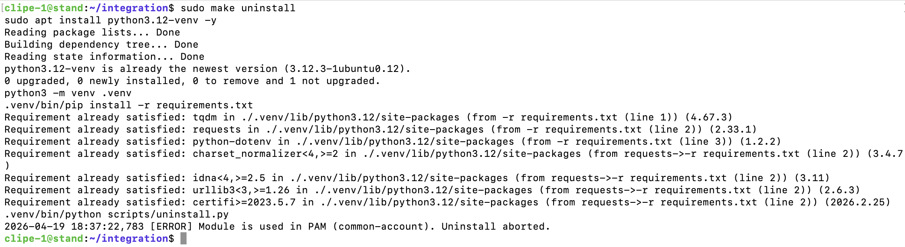

# Описание

## Краткое описание
CLiPE система контроля доступа на основе политик и правил для Linux-хостов.
Представляет собой сервер принятия решений с панелью администратора и модуль интеграции.

## Используемые технологии

| Зона ответственности            | Технологии |
|--------------------------------|-----------|
| REST API сервер                       | Go + Gin |
| Модуль интеграции               | C++ (PAM)|
| Панель администратора                    | JavaScript |
| База данных                   | PostgreSQL|
| Инфраструктура и деплой       | Docker|
| Сборка и установка            | CMake + Make |
| Автоматизация                 | Python |
| Тестирование API                  | Hoppscotch|
| Среда разработки / тестирования | Ubuntu 24.04 (ARM64), VMware Fusion|

# Архитектура


# Конфигурация

## Сервер

### GIN_MODE
Отвечает за логирование. Допустимые значения:
- release (логирование только вызываемых эндпоинтов) 
- debug (вывод дополнительной информации об ошибках и поведении)

### DECISION_SERVER_PORT и CRUD_SERVER_PORT
Отвечают за то, какой порт будут слушать соответствующие серверы

### DEFAULT_DECISION
Отвечает за решение по умолчанию для ситуаций, когда для конкретного сервиса не существует политики или правила. Допустимые значения:
- true (если нет политики/правила), то ответ всегда ALLOW
- false (если нет политики/правила), то ответ всегда DENY

### API_VERSION
Отвечает за конфигурацию версии API, по которому осуществляется доступ к эндпоинтам сервера, например `http://access.manager/api/v1`


### JWT_SECRET_KEY
Отвечает за секретный ключ для JWT аутентификации

### Конфигурация БД
- DB_HOST
- DB_PORT
- DB_USER
- DB_PASSWORD
- DB_NAME

## Пример конфигурации сервера

``` text
GIN_MODE=debug

DECISION_SERVER_PORT=8080
CRUD_SERVER_PORT=8081

DEFAULT_DECISION=true 

API_VERSION=1

JWT_SECRET_KEY=6f8c2a9d4e1b7c3f0a5d8e9c1b2f4a6d7e8c9f0a1b2c3d4e5f6a7b8c9d0e1f2

DB_HOST=clipe_db
DB_PORT=5432
DB_USER=postgres
DB_PASSWORD=password
DB_NAME=clipe
```

## Модуль интеграции

### URL
Отвечает за указание адреса сервера, на котором развернут сервер CLiPE, указывает протокол и DNS имя, например:
``` text
http://access.manager
```

# Сборка
#### ! Собранная библиотека под ubuntu-24.04.4-desktop-arm64 уже находится в /integration !

Сборка динамической библиотеки осуществляется в целевой среде при помощи следующих зависимостей:
``` bash
sudo apt install -y \
    cmake \
    g++ \
    libpam0g-dev \
    nlohmann-json3-dev \
    libcurl4-openssl-dev
```

Непосредственная компиляция производится следующим образом:
1. Из папки `/pam_module` выполнить команду
``` bash
cmake -S . -B build
```
2. Из той же папки запустить сборку проекта
``` bash
cmake --build build
```
3. Скопировать/заменить собранную библиотеку в папку `/integration`
``` bash
cp build/lib/pam_clipe.so ../integration
```

# Развертывание
## Сервер

В системе реализовано безопасное соединение по HTTPS, для него необходим серверный сертификат, подписанный центром сертификации (если он уже есть, то можно сразу перейти к пунтку )

1. Создание локального центра сертификации
``` bash
openssl genrsa -out ca.key 4096 &&
openssl req -x509 -new -nodes \
  -key ca.key \
  -sha256 \
  -days 3650 \
  -out ca.crt
```

2. Создание серверного приватного ключа
``` bash
openssl genrsa -out server.key 2048
```

3. Создание запроса на выпуск серверного сертификата
``` bash
openssl genrsa -out server.key 2048
```

4. Подписание серверного сертификата
``` bash
openssl x509 -req \
  -in server.csr \
  -CA ca.crt \
  -CAkey ca.key \
  -CAcreateserial \
  -out server.crt \
  -days 365 \
  -sha256 \
  -extfile server.ext
```

5. Для развертывания сервера необходим установленный `docker`
``` bash
sudo apt install docker -y
```
1. После успешной установки `docker` перейти в папку `/server` и выполнить запуск со сборкой
``` bash
make build
```

## Linux-хост для интеграции

1. Скопировать/заменить сертификат доверенного центра сертификации в `/integration`
``` bash
cp ssl/ca.crt ./integration
```

2. Скопировать папку `/integration` на хост, на котором будет осуществляться контроль доступа к сервисам
``` bash
scp -r ./integration user_name@host_name:~/path/to/directory
```

# Интеграция

Реализована PAM библиотека для интеграции системы непосредственно на Linux-хост.

Администрирование модуля осуществляется при помощи заготовленных `Python`-скриптов, для более удобной работы посредником выступает `Makefile`, в котором определены следующие цели. Каждую цель запускается от имени `root` (через `sudo`).

## Цели:
### 1. install 

Выполняется установка необходимых библиотек, регистрация хоста и пользователей данного хоста в системе и автоматическое копирование `pam_clipe.so`.


### 2. refresh

Выполняется синхронизация пользователей: удаление несуществующих пользоватлей и регистрация неучтенных в системе.


### 3. uninstall

Выполняется проверка использования `pam_clipe.so`, при нахождении в PAM-таблицах, удаление прерывается до прекращения использования целевой библиотеки. При условии, что модуль больше не используется производится удаление пользоватлей и хоста из системы



Для использования интегрированной системы необходимо указать использование `pam_clipe.so` в PAM-таблице соответствующего сервиса или общей PAM-таблице (common-auth, common-account, ...)

## Использование библиотеки `pam_clipe.so`.
### Добавление в PAM-таблицу common-account
Для инициализации работы модуля в системе необходимо объявить библиотеку в соответствующей PAM-таблице с [необходимым флагом](https://man7.org/linux/man-pages/man5/pam.d.5.html), например, в common-account в флагом required:


### Отладка
`pam_clipe.so`. поддерживает режим отладки, для его включения необходимо указать соответствующий аргумент около указанной библиотеки


## Логирование

Данная библиотека поддерживает логирование в `syslog`, для просмотра логов необходимо обратиться к `/var/log/auth.log`, например, при помощи `tail`.

### Релизный режим
---
#### ALLOW


#### DENY


### Отладочный режим
---
#### ALLOW
